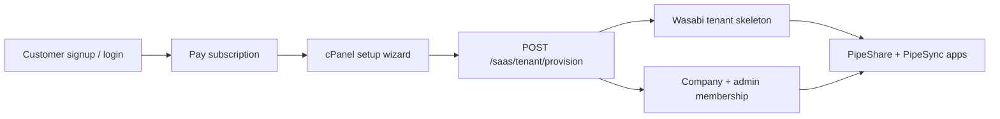

# SaaS tenant architecture (Horizonpipe / Pipeshare variant)

Phase 0 inventory of what exists today and the proposed multi-tenant SaaS model for the cPanel-style Horizonpipe variant.

## What exists today

### Auth & sessions

- JWT sessions via `POST /login`, validated by `requireAuth` middleware.
- `GET /session` returns normalized user + `capabilities` from `capabilities.js`.
- Self-signup: `POST /signup/request` + `POST /signup/verify` (email PIN, admin approval required before access).
- Account settings: `GET/PUT /account/settings`.

### Permissions model

| Layer | Tables / module | Purpose |
|-------|-----------------|--------|
| Global staff | `users.is_admin`, `roles` jsonb, `employee_role` | PipeSync planner, pricing, admin panel |
| Portal scope | `user_portal_scopes`, `portal_path_grants` | Legacy client/job + folder ACL |
| Company RBAC | `companies`, `company_roles`, `company_folder_grants`, `user_company_membership` | Per-company roles (admin/employee/customer) + folder templates |
| User grants | `user_folder_grants` | Per-user folder overrides (PipeShare / PipeSync apps) |
| Capabilities | `resolveCapabilities()` | Stable client contract on `/session` |

There is **Stripe billing** for the Horizonpipe SaaS variant (`saas-billing.routes.js`, webhooks update `saas_tenant_instances.subscription_status`). The legacy `subscription-panel.html` iframe shell remains for an optional external panel.

### Wasabi / S3 layout (single deployment)

| Prefix | Used by |
|--------|---------|
| `clients/{clientId}/jobs/{jobId}/{videos\|db3\|pdf\|photos}/` | PipeShare portal files |
| `app-data/horizon-admin/attachments/` | Daily reports, jobsite assets |
| `app-data/horizon-pipesync/plan-pages/` | PipeSync plan view |
| `app-data/horizon-pipesync/plan-workspace-saves/` | Plan workspace checkpoints |
| `clients/portal-users/jobs/3/system-state` (env: `WASABI_PIPESYNC_STATE_PREFIX`) | Auth/users snapshot (`latest.json`) |

Folder markers use `.hp-folder` objects (see `portal-files.routes.js`).

### Frontend surfaces

| Surface | Entry | Notes |
|---------|-------|-------|
| PipeSync | `pipesync.html`, `mobile.html` | Staff planner |
| PipeShare | `client-portal/index.html` | Client file portal |
| Login | `login.html` → React `login-main.tsx` | `?product=pipesync\|pipeshare` |
| Branding | `theme-profile.js`, `public/branding/<tenant>/` | White-label logos (JEA, FDOT, etc.) |
| Subscription shell | `subscription-panel.html` | Expects external panel origin meta tag |

### “Tenant” today

- **Companies** (`companies` table) = organizational units inside the **single** Horizon deployment (Horizon Pipe, AJJ, JUM, …).
- **Theme registry** tenant ids (jea, fdot) = static logo packs, not isolated data.
- **Not** separate provisioned Pipeshare instances per paying customer.

---

## Proposed SaaS architecture

### Product flow



1. Customer creates account (reuse signup routes).
2. Stripe Checkout → webhook sets `subscription_status` on `saas_tenant_instances`.
3. Setup wizard collects branding → `PUT /saas/tenant/setup`.
4. Provision → Wasabi folders + bind owner as tenant admin scoped to `portal_client_id` / `portal_job_id`.
5. cPanel dashboard launches PipeShare/PipeSync with tenant branding meta tags.

### Database (new)

**`saas_tenant_instances`** (scaffolded in `ensureSchema`):

| Column | Purpose |
|--------|---------|
| `company_id` | FK to `companies` (one company per SaaS customer) |
| `owner_user_id` | Paying customer / tenant admin |
| `wasabi_root_prefix` | e.g. `tenants/acme-plumbing/` |
| `portal_client_id`, `portal_job_id` | Isolated portal scope |
| `branding` jsonb | Logo keys, colors, website |
| `subscription_status` | pending \| trialing \| active \| past_due \| canceled |
| `stripe_*` | Customer/subscription ids (Phase 2) |
| `setup_status` | draft \| provisioning \| ready \| failed |

Extend later (Phase 2+):

- `saas_tenant_domains` — custom hostname → tenant id
- `saas_tenant_addons` — leased tool entitlements
- Tenant-scoped `capabilities` (avoid global `is_admin` for SaaS owners)

### Wasabi path convention (per tenant)

Root: `tenants/{company-slug}/`

```
tenants/{slug}/
  branding/                    # logo uploads, color samples
  clients/tenant-{slug}/jobs/1/
    videos/  db3/  pdf/  photos/
    system-state/              # tenant-scoped snapshot (future)
  app-data/
    horizon-admin/attachments/
    horizon-pipesync/plan-pages/
    horizon-pipesync/plan-workspace-saves/
    addons/                    # leased tools
  sql-mirror/                  # optional per-tenant SQL mirror
```

Helpers: `lib/saas-tenant-paths.js`, provisioning: `tenant-provisioning.service.js`.

### API routes (scaffolded)

| Method | Path | Auth | Purpose |
|--------|------|------|---------|
| GET | `/saas/tenant/me` | yes | Current user's tenant record |
| PUT | `/saas/tenant/setup` | yes | Save wizard draft |
| POST | `/saas/tenant/provision` | yes | Create Wasabi skeleton + admin binding |
| GET | `/saas/tenant/status` | yes | Setup + subscription status |
| POST | `/saas/billing/checkout-session` | yes | Stripe Checkout for subscription |
| POST | `/saas/billing/webhook` | Stripe signature | Subscription lifecycle events |
| GET | `/saas/billing/portal` | yes | Stripe Customer Portal session URL |
| GET | `/saas/billing/status` | yes | Subscription summary for cPanel |

Phase 2 (remaining):

- `POST /saas/tenant/branding/upload-url` (presigned PUT under `tenants/{slug}/branding/`)

### Frontend variant (scaffolded)

`horizonpipe-cpanel/` — cPanel-style shell:

- `index.html` — dashboard tiles (PipeShare, PipeSync, Setup, Billing)
- `setup.html` — branding wizard
- `login.html` — redirects to unified `login.html?product=horizonpipe`

Env bypass for dev: `SAAS_SKIP_SUBSCRIPTION_CHECK=1` on backend.

### Stripe setup (Phase 2)

1. Create a **Product** and recurring **Price** in the [Stripe Dashboard](https://dashboard.stripe.com/products).
2. Add env vars on horizon-backend (see `.env.example`):
   - `STRIPE_SECRET_KEY` — secret API key (`sk_test_…` or `sk_live_…`)
   - `STRIPE_WEBHOOK_SECRET` — signing secret from a webhook endpoint pointing at `POST /saas/billing/webhook`
   - `STRIPE_PRICE_ID` — recurring price id (`price_…`)
   - Optional: `STRIPE_SUCCESS_URL`, `STRIPE_CANCEL_URL`, `STRIPE_PORTAL_RETURN_URL`, `SAAS_CPANEL_BASE_URL`
3. Install dependency: `npm install` (adds `stripe` package).
4. **Webhook events** handled: `checkout.session.completed`, `customer.subscription.created|updated|deleted`, `invoice.payment_failed`.
5. Webhook route uses `express.raw({ type: 'application/json' })` and is registered **before** the global `express.json()` middleware in `server.js`.
6. Local webhook testing: `stripe listen --forward-to localhost:3000/saas/billing/webhook` (CLI prints `whsec_…` for `STRIPE_WEBHOOK_SECRET`).
7. Customer flow: cPanel **Billing** → `POST /saas/billing/checkout-session` → Stripe Checkout → webhook sets `subscription_status` on `saas_tenant_instances` → setup wizard → provision.

Enable **Stripe Customer Portal** in Dashboard settings for **Manage billing** (`GET /saas/billing/portal`).

### Tenant admin vs global admin

**Phase 1 (scaffold):** Owner gets `portal_permissions_access`, `portal_files_access_granted`, and `user_company_membership.role_key = admin` scoped to their company.

**Phase 2:** Extend `resolveCapabilities()` with `tenantAdmin` + middleware that rejects cross-tenant API access. Avoid setting global `is_admin` for SaaS customers.

### Phased delivery

| Phase | Scope |
|-------|--------|
| **1** (this scaffold) | Schema, path helpers, provisioning skeleton, cPanel HTML shell, docs |
| **2** | Stripe Checkout + webhooks (implemented), presigned branding uploads, subscription gating |
| **3** | Tenant-scoped auth/capabilities, custom domains, per-tenant Wasabi state prefix |
| **4** | Leased addons folder wiring, automated PipeShare instance URL, ops monitoring |

## PipeShare Base + PipeShare SaaS (one codebase)

Mike's **private base** (`pipeshare.live`, `HP_DEPLOYMENT_MODE=non-saas`) and the **subscription platform** (`pipeshare.net` + tenant subdomains, `HP_DEPLOYMENT_MODE=saas`) run the **same repos**. Differences are env + host, not separate forks.

### Single profile module

`lib/deployment-profile.js` is the backend source of truth. It exposes:

- `mode`: `saas` | `non-saas`
- `features.*`: boolean gates (billing, tenant virtualbox, publish vs apply, dev PIN, …)
- `storage.*`: bucket layout hints (`portal-users/8` on base, `tenant-{slug}/1` on SaaS)
- Host-aware `tenantSlugFromHost` for `{Biz}.pipeshare.net`

Browsers load the same profile via:

1. `GET /public/deployment-bootstrap.js` (before login, sets `window.__HP_DEPLOYMENT_CONFIG__`)
2. `/login` and `/session` → `deploymentProfile` (refreshed after auth)

Frontend: `client-portal/scripts/services/deployment-profile.js` — use **`deploymentFeatureEnabled('…')`** instead of scattered `getDeploymentMode()` checks.

### Rule: SaaS-first code, base exceptions

| Concern | Default (SaaS) | Base exception |
|---------|----------------|----------------|
| Wasabi tenant prefix | `Tenants/{slug}/` in `SAAS_WASABI_BUCKET` | Legacy `WASABI_BUCKET` + `clients/portal-users/…` |
| Portal scope | `tenant-{slug}/1` on tenant host | `portal-users/8` (platform admins never auto-bound to tenant scope) |
| Code delivery | cPanel **Apply** platform release | Direct git/PM2 deploy + optional **Publish** |
| Signup PIN | Email only | Dev PIN when SMTP missing |
| Subscription gate | Active/trialing required on tenant hosts | Not required |

**Never branch on hostname alone in app code** — use `deploymentProfile.features` or capabilities from `/session`.

### Test on base → ship to SaaS workflow

1. Develop on **base** (`pipeshare.live`, `non-saas` env) — full PipeShare + PipeSync, legacy bucket.
2. Commit to `main` (both repos).
3. Deploy base (PM2 reload or `github-deploy.sh`).
4. **Publish** platform release artifact from base cPanel (writes to Wasabi `platform/releases/`).
5. On SaaS host, **Apply** the same artifact — code updates without touching tenant data (Postgres rows, `Tenants/{slug}/` keys, Stripe, URLs stay per customer).

Tenant **dynamic data** (URLs, branding, bucket prefix, auth snapshot) lives in Postgres + Wasabi under `saas_tenant_instances` — platform releases only swap **code/static**, not customer data.

### Ops: single hybrid backend (recommended) or dual PM2 (optional)

**Recommended:** one PM2 app on port **3000**, `HP_DEPLOYMENT_MODE=hybrid`. nginx sends **both** `pipeshare.live` and `pipeshare.net` (+ tenant subdomains) to the same upstream. Mode is derived per request from hostname:

| Host | Mode |
|------|------|
| `pipeshare.live` | `non-saas` (Base) |
| `pipeshare.net`, `*.pipeshare.net` | `saas` |

Publish from cPanel on **pipeshare.live**; Apply on **pipeshare.net** — same Node process, different host profile.

**Optional:** two PM2 apps (`.env.base` / `.env.saas`, ports 3000/3001) — see `deploy/ovh/ecosystem.dual.config.cjs`.

Do not `sed` flip `HP_DEPLOYMENT_MODE` on a shared `.env` in production.

### Integration testing tenant paths on base

Set `SAAS_SKIP_HOST_BINDING=1` on a **staging** base host to relax tenant host↔slug binding when debugging SaaS Wasabi paths without wildcard DNS. Production SaaS keeps strict binding.
